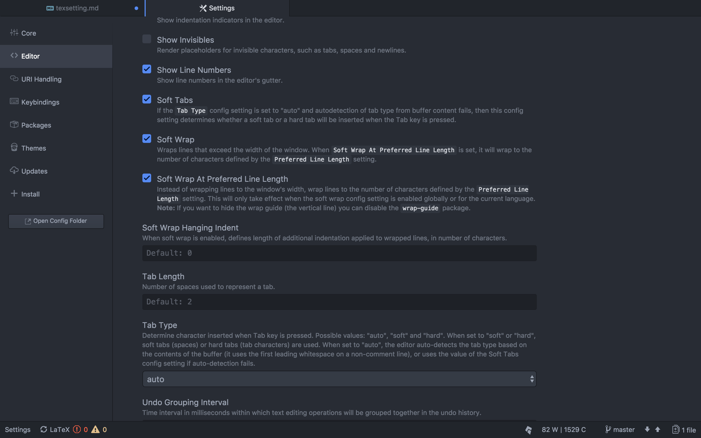
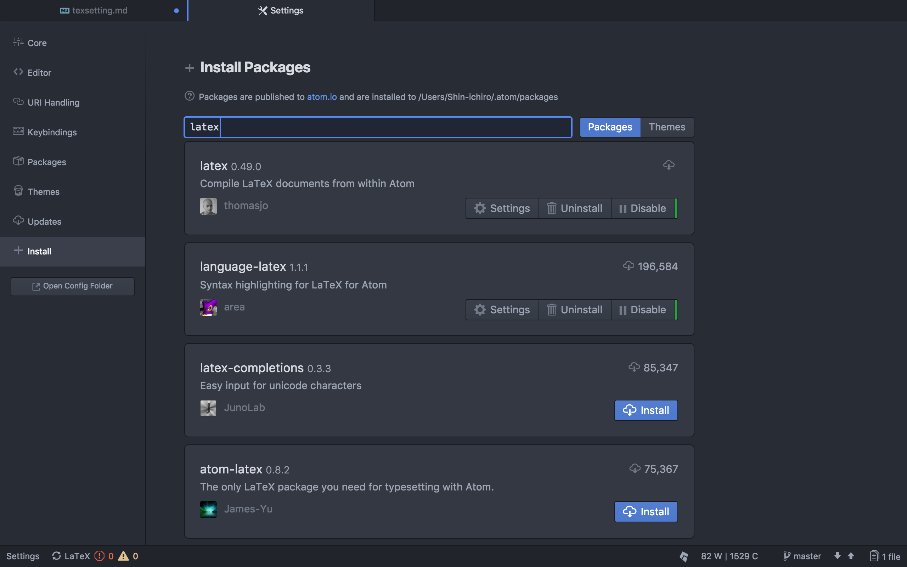
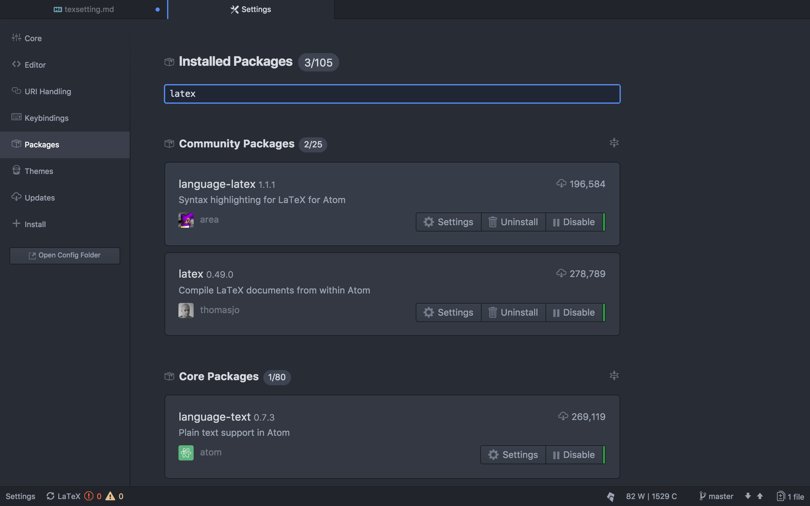
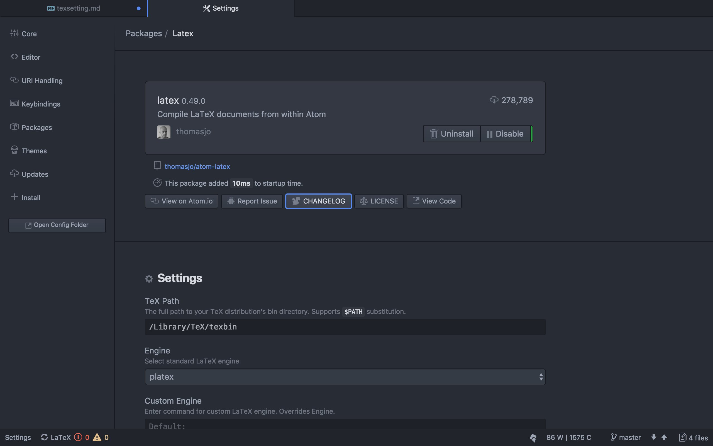
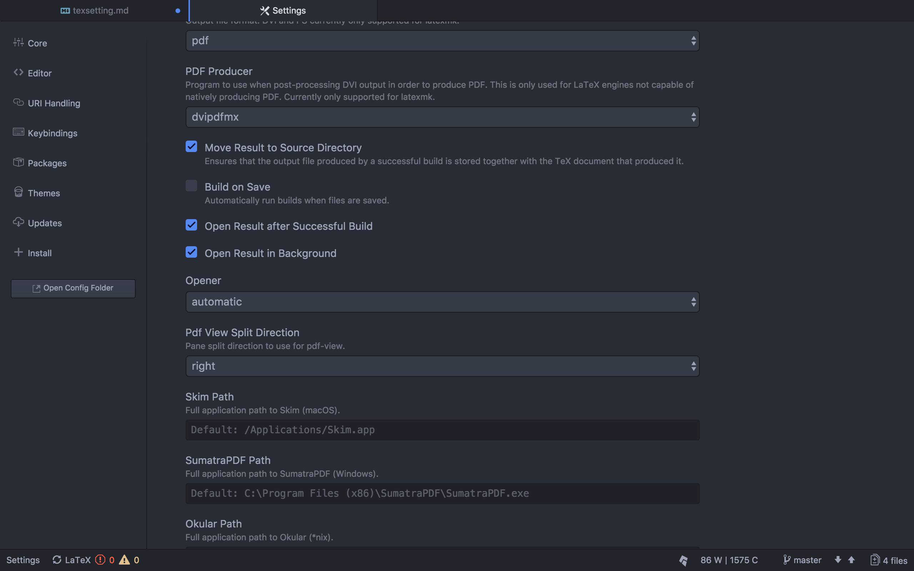

# UbuntuとMacにおける卒論用LaTexの設定
## Texliveのインストール
### 手順
インストーラーのダウンロード
`wget http://mirror.ctan.org/systems/texlive/tlnet/install-tl-unx.tar.gz`

インストーラーの展開
`tar xvf install-tl-unx.tar.gz`

インストーラーに入る(後半は日付なのでその時々に変わる)
`cd install-tl20171222`

実行(途中で本当にインストールするか聞かれるのでIを押すとインストールが始まる)
`sudo ./install-tl`

## Texliveのbinをパスに追加する
Texliveのbinは`/usr/local/texlive/2017/bin`(来年の途中くらいで2018になるかも)にあるので、`export PATH=$PATH:/usr/local/texlive/2017/bin`を.bashrc(bashの人)とか.zshenv(zshの人)とかに書く。

## tlmgr(Texliveのpackage管理ツール)の設定

### 初期設定
`sudo tlmgr option repository http://mirror.ctan.org/systems/texlive/tlnet`

### 更新する時
`sudo tlmgr update --self --all`

## 日本語フォント埋め込み
日本語でうまくいかないときはこれをすると良いのではじめにしとくと良いです。
`sudo kanji-config-updmap-sys ipaex`

## latexmk(一発で.texから.pdfになります)の設定

### 手順
latexmkのインストール
`sudo apt install latexmk`

.latexmkをホームディレクトリに作る
.latexmkはドライブにあげといたのでそれを使ってください。

実行は`latexmk なんとか.tex`です。(簡単！)

## 卒論時に使うtex
UbuntuとMacで動くものをドライブにあげときました。
`naito-thesis.tex`がメインファイルです。**いくつかのusepackageをコメントアウトしてますが図を入れたりした時に必要を思われるのでコメントを外すかもしれません。**
referenceは佐川さんからもらったんのに１つ追加して１つ書き換えました。
documentの書き方は同じです。

## Atomを使って快適に
Atomにlatexのpackageを入れて使うと編集が快適になります。

### Atomでの日本語設定
Atomは初期設定では１つの行が長くても折り返してくれないので使いにくいです。
そんな時はAtomの全体設定(ctrlと,を押すと出ます)のエディタ設定にあるSoft Wap（折り返し）の項目２つにチェックすると良いです。

### 追加するパッケージ
latex と　language-latex　を入れましょう。language-latexは入れなくても良いですがなれると保管が便利です。
入れ方はAtomの全体設定のinstall(インストール)のところでlatexで検索すると出るので、インストールを押せば良いです。

### latexパッケージの設定
Atomの全体設定のpackage(パッケージ)のところでlatexで検索すると出てくるので、設定を押してください。

まずはPATHを設定します

複数のtexファイルに分けて書く時はセーブするたびにbuildされるとdocumentの下に置いている分割ファイル自体がbuildされて面倒なので外します。

### build(latexmkの実行)
`ctrl+alt+b`でできます。

Macならこれで良いですが、Ubuntuだとバーチャルキーボードが立ち上がるホットキーに割り当てられていて面倒です。

#### その解決方法
バーチャルキーボードはUbuntuで日本語入力のために入れたfcitxの機能です。

そこで`/usr/local/fcitx/addon/fcitx-vk.conf`の`Enable=True`を`Enable=False`に変えてUbuntuを再起動すると出なくなり、Atomでのlatexのbuildが簡単にできます。

### Atomでの他のキーバインド
`ctrl+alt+c`でlatexの中間ファイルが消えてスッキリします。ただpdfも消えるのである程度の完成版を取っておきたい時は他のディレクトリに移してから実行しましょう。
